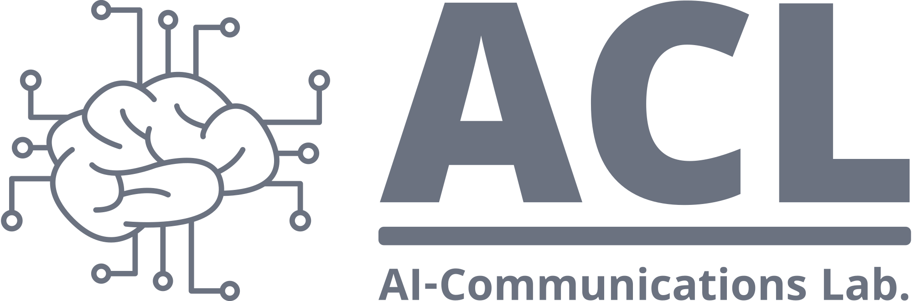

  

  
  &nbsp;
  
## 👋 Welcome to AI-Comm. Lab. at PKNU! ##
At the AI-Comm. Lab., we are exploring cutting-edge researches in artificial intelligence and next-generation wireless communication systems.
Our work focuses on advancing technologies that are shaping the future of intelligent, secure, and efficient distributed AI life.
<!-- Key Technologies: Data privacy, Distributed AI, Information theory, MIMO technology.  -->

## 🎓 Join Us! ##
We are always looking for passionate and motivated students—both undergraduate and graduate—who are eager to explore these exciting fields. If you are interested in joining our research group, please feel free to contact ssyun at pknu.ac.kr with curious minds and collaborative spirits!

Thank you for your interest in our lab, and we look forward to connecting with you.

## 📢 Recent News ##